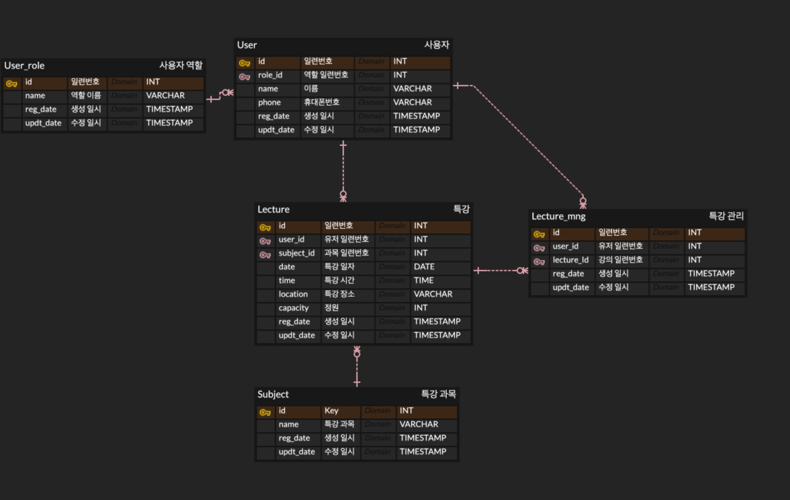

## ERD


- `동일한 특강의 기준` : 강사가 다르더라도 특강 과목이 같으면 같은 강의로 본다. 대학교의 과목과 같은 방향으로 설정. 
- ex) 김재일 - 클린아키텍쳐에 관한 특강 (2024.12.26)을 신청한 사람은 김재이 - 클린아키텍쳐에 관한 특강 (2024.12.27)을 신청하지 못한다.
- 성능을 위해 실제 테이블에서는 FK를 설정하지 않음.
### lecture 특강테이블
```sql
TABLE Lecture (
id INT PK,          --일련 번호
user_id	INT,        --사용자 일련 번호
subject_id INT,     --과목 일련 번호
date DATE,          --강의 날짜 
time TIME,          --강의 시간
location VARCHAR,   --강의 장소
capacity INT,       --강의 정원
reg_date TIMESTAMP, --생성 일시
updt_date TIMESTAMP --수정 일시
);
```
- 특강 리스트를 등록할 수 있는 테이블이며 id가 PK가 된다
- user_id와 subject_id는 각각 user, subject 테이블의 id와 매핑될 수 있다
- 정원은 capacity로 한다
- | id | user_id | subject_id | date| time  | location |capacity|
  |----|----|----|----|-------|----------|------|
  | 1  | 3  | 1  | 2025-01-03| 14:00 | 컨벤션 홈    | 30
  | 2  | 3  | 2  | 2025-01-06| 15:00 | 스파르타 광장  | 30
  | 3  | 4  | 2 |2025-01-03| 14:00 | 하모니홀     | 30
  |  4  | 4  | 4  |2025-01-11| 16:00 | 컨벤션 홈    | 30

### User 사용자 테이블
```sql
Table User (
id INT PK,          --일련 번호
role_id INT,        --역할 일련 번호
name VARCHAR,       --이름
phone VARCHAR,      --휴대폰 번호
reg_date TIMESTAMP, --생성 일시
updt_date TIMESTAMP --수정 일시
)
```
- 사용자를 등록할 수 있는 테이블이며 id가 PK가 된다
- role_id는 role테이블의 id과 매핑될 수 있다
- | id | rold_id | name | 
  |----|---------|------|
  | 1  | 1       | 김지은  |
  | 2  | 1       | 박소라  |
  | 3  | 2       | 최아영  |
  |  4  | 2       | 오진영  |

### Lecture_mng 특강 관리 
```sql
Table LectureMng(
id INT PK,          --일련 번호
user_id INT,        --유저 일련 번호
lecture_id INT,     --과목 일련 번호
reg_date TIMESTAMP, --생성 일시
updt_date TIMESTAMP --수정 일시
)
```
- 사용자가 신청한 특강 정보가 등록되는 테이블이며 id가 PK가 된다
- user_id와 lecture_id 각각 user와 lecture의 id와 매핑된다
- | id | user_id | lecture_id 
  |----|---------|------------|
  | 1  | 1       | 1          |
  | 2  | 1       | 2          |
  | 3  | 2       | 4          |
  |  4  | 3       | 1          |

### Subject 특강 과목
```sql
Table Subject(
id INT PK,          --일련 번호
name VARCHAR,       --특강 과목
reg_date TIMESTAMP, --생성 일시
updt_date TIMESTAMP --수정 일시
)

```
- 특강 과목에 관한 테이블이며 id가 PK가 된다
- | id | name       |
  |----|------------|
  | 1  | JPA의 이해    |
  | 2  | 클린아키텍쳐의 이해 |
  | 3  | JPA 실전     |
  |  4  | 클린아키텍쳐 실전  |
### UserROle 사용자 역할
```sql
Table UserRole(
id INT PK,          --일련 번호
name VARCHAR,       --역할 이름
reg_date TIMESTAMP, --생성 일시
updt_date TIMESTAMP --수정 일시
)
```
- 사용자 역할에 관한 테이블이며 id가 PK가 된다
- | id | name |
  |----|------|
  | 1  | 학생   |
  | 2  | 강사   |
